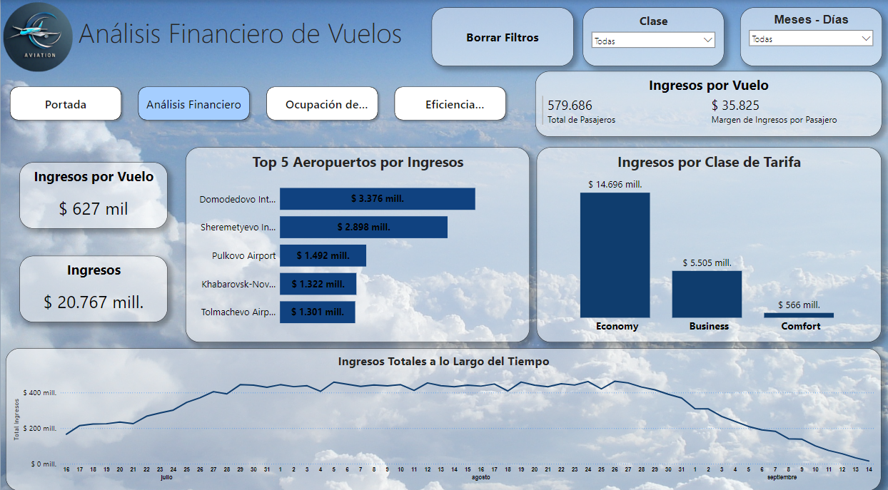
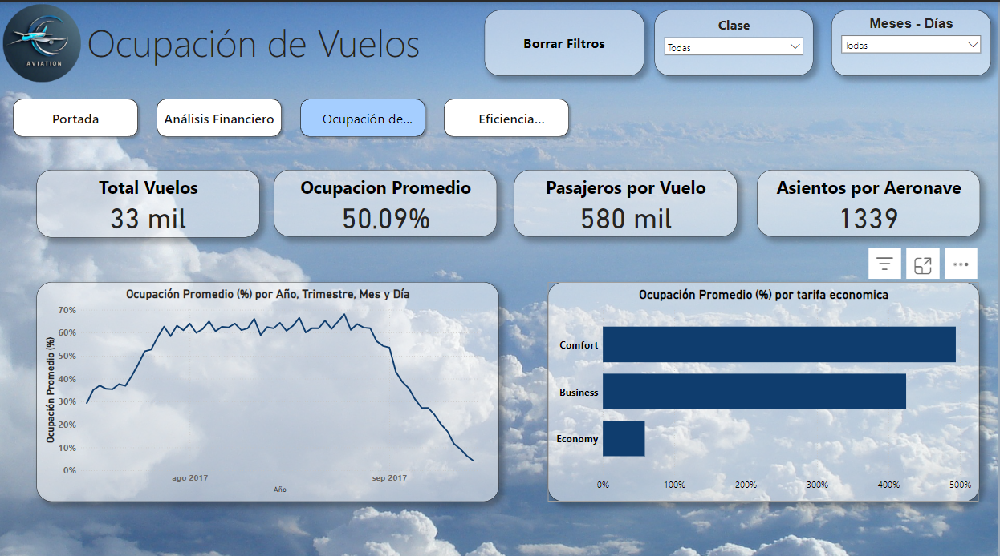
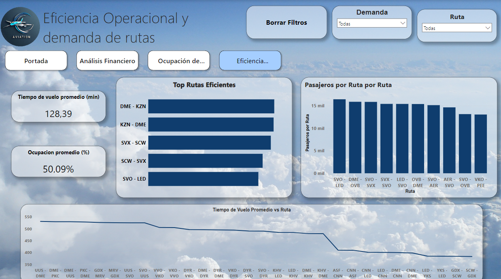

<h1 align="center" style="font-size: 3.5em; color: #0d1117; font-family: 'Segoe UI', Tahoma, Geneva, Verdana, sans-serif; font-weight: 600; text-shadow: 2px 2px 4px rgba(0,0,0,0.2);">
  EcoData
</h1>

  

 
## Índice

1. [Contexto](#contexto)
2. [Características](#características)
3. [Requisitos](#requisitos)
4. [Instalación](#instalación)
5. [Estructura del Proyecto](#estructura-del-proyecto)
6. [Enlaces](#enlaces)
7. [Reportes - Power BI](#reportes---power-bi)
8. [Colaboradores](#colaboradores)
9. [Tecnologías](#tecnologías)

## Contexto

El proyecto de "Análisis de Ocupación de Vuelos" tiene como finalidad ayudar a las aerolíneas a optimizar la ocupación de sus vuelos, mejorando así la rentabilidad y la experiencia del pasajero. La ocupación de los vuelos es un factor critico que impacta directamente en la rentabilidad de las aerolineas. Con la creciente presion para optimizar costos y maximizar la eficiencia, las aerolineas buscan comprender como afecta la ocupacion de sus vuelos y competir en un entorno desafiante, donde la eficiencia operativa y la satisfaccion del cliente son cruciales para mantenerse competitivas.

Actualmente las aerolineas necesitan herramientas mas sofisticadas para analizar y predecir la ocupacion de sus vuelos, asi como para tomar decisiones informadas sobre rutas y flotas. 

El objetivo es desarrollar un analisis detallado de la tasa de ocupacion de los vuelos a lo largo del tiempo, esto permitira identificar tendencias y patrones, asi como optimizar la asignacion de recursos. Integrara un analisis avanzado con la visualizacion de datos proporcionando un enfoque mas dinamico y adaptable.

Proporcionara a las aerolineas insights valiosos  sobre la efeciencia de sus operaciones y les  permitira ajustar sus estrategias para ser mas competitivas en el mercado.

## Fuentes de datos

- Se trabajara con un dataset denominado Travel.sqlite, extraida desde la url:https://www.kaggle.com/datasets/saadharoon27/airlines-dataset?resource=download.
- La extension del archivo es .sqlite
- Se utilizaran las siguientes tablas:
  Aircrafts_data: Contiene detalles sobre las aeronaves utilizadas.
  Airports_data: Proporciona información sobre los aeropuertos.
  Boarding_passes:  Contiene información relacionada con los pases de abordar de los pasajeros.
  Bookings: Estos datos provienen del sistema de reservas de pasajeros y reflejan las tendencias de demanda y las decisiones de los consumidores.
  Flights: proporciona información sobre cada vuelo realizado.
  Seats: Contiene información sobre la configuración de asientos en cada aeronave.
  Ticket_flights: Registra todos los tickets vendidos para cada vuelo.
  Tickets: Contiene la información de los tickets emitidos.

## Requisitos

- Python 3.x
- pandas
- matplotlib
- seaborn
- numpy
- jupyter
- Scikit-Learn
- SQL
- Power Bi

## Instalación

1. Clona este repositorio:
   git clone https://github.com/FlamInIFabrIzIo/proyecto_final_henry.git
2. Crear un entorno virtual: 
3. Activar el entorno virtual: .
3. Instalar dependencias:   
4. Ejecuta la aplicación:   

## Estructura del Proyecto

- Airlines/
- │
- ├── data/                    # Directorio para los datos procesados.
- ├── images/                  # Imagenes del readme.
- ├── Notebooks/               # Jupyter Notebooks para análisis exploratorio y Machine .Learning
- ├── app.py                   # Archivo de aplicación del deploy en Streamlit.
- ├── README.md                # Este archivo README.
- ├── requirements.txt         # Archivo de requisitos.
- └── ...

## Enlaces

Dashboard: https://app.powerbi.com/view?r=eyJrIjoiNTEzM2M3MjQtNDE2ZS00OTc2LTk5ZDEtZDg1OWUyZmRjZmIwIiwidCI6Ijk4YjVlNzlkLWEwODYtNGU3OC04NDUxLTgxMmE3MGM0NWRlNyIsImMiOjR9&pageName=ee96d4157dfda6adb7a8

Deploy: 

  

## Reportes - Power BI

  
  
  

## Colaboradores

|                         | Nombre   |   Rol                    | GitHub & LinkedIn                                                                                                                                                                                          |
| ----------------------------- | -------- | ---------------------- | ------------------------------------------------------------------------------------------------------------------------------------------------------------------------------------------------------- |
|  | Cande Utello | Data Analyst  |                           |
|                               |
|  | Belkys Dellamea | Data Analyst |                           |
|                               |
|  | Carlos | Data Analyst |                           |
|                               |
|  | Fabrizio Flamini | Data Engineer |                           |
|                               |
|  | Ignacio Cardetti | Data Engineer |                           |
|                               |

## Tecnologías

